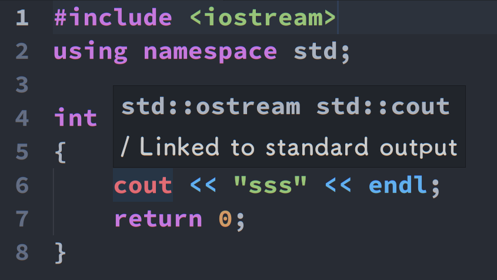
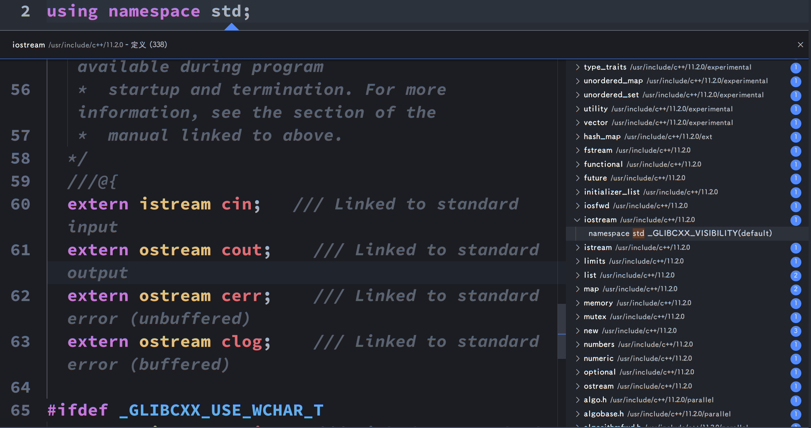

# 命名空间

## 定义

假设这样一种情况，a项目中写了一个名为 xyz() 的函数，在另一个项目b中也存在一个相同的函数 xyz()。这样，编译器就无法判断所调用的是哪一个项目的 xyz() 函数。<br><br>

因此，引入了命名空间这个概念，专门用于解决上面的问题，它可作为附加信息来区分不同库中相同名称的函数、类、变量等。使用了命名空间即定义了上下文。本质上，命名空间就是定义了一个范围。<br><br>

就像在计算机中，一个文件夹中可以包含多个文件夹，每个文件夹中不能有相同的文件名，但不同文件夹中的文件可以重名。如下图：


## 定义一个命名空间

命名空间的定义使用关键字 namespace，后跟命名空间的名称，如下所示：

```c++
namespace first_space {
   // 代码声明
   void func(){
   }
}
```

为了调用带有命名空间的函数或变量，需要在前面加上命名空间的名称，如下所示：

```c++
first_space::func();
```

## using指令

可以使用 using namespace 指令，这样在使用命名空间时就可以不用在前面加上命名空间的名称。这个指令会告诉编译器，后续的代码将使用指定的命名空间中的名称。

```c++
#include <iostream>
using namespace std;
 
// 第一个命名空间
namespace first_space{
   void func(){
      cout << "第一个命名空间" << endl;
   }
}
using namespace first_space;
int main ()
{
 
   // 调用第一个命名空间中的函数
   func();
   cout << "仍然可以使用std空间中的cout" << endl;
   return 0;
}
```

运行结果：

```shell
第一个命名空间
仍然可以使用std空间中的cout
```

using 指令也可以用来指定命名空间中的特定项目。例如，如果如果只打算使用 std 命名空间中的 cout 部分，可以使用如下的语句：

```c++
#include <iostream>
using std::cout;
 
int main ()
{
 
   cout << "可以使用cout" << std::endl;
   
   return 0;
}
```

```shell
可以使用cout
```

using 指令引入的名称遵循正常的范围规则。名称从使用 using 指令开始是可见的，直到该范围结束。此时，在范围以外定义的同名实体是隐藏的。如以下：

```c++
#include <iostream>
using namespace std;

// 第一个命名空间
namespace first_space
{
    void func()
    {
        cout << "第一个命名空间" << endl;
    }
}
// 第二个命名空间
namespace second_space
{
    void func()
    {
        cout << "第二个命名空间" << endl;
    }
}
using namespace first_space;
int main()
{
    // 调用第一个命名空间中的函数
    func();
    if (true)
    {
        using namespace second_space;
        // 调用第一个命名空间中的函数
        second_space::func(); //此处必须声明是空间，因为有两个空间中均有func函数
    }
    func();//此处不必声明空间，因为second_space范围只到if块。
    return 0;
}
```

```shell
第一个命名空间
第二个命名空间
第一个命名空间
```

## 不连续的命名空间

命名空间可以定义在几个不同的部分中，因此命名空间是由几个单独定义的部分组成的。一个命名空间的各个组成部分可以分散在多个文件中。<br><br>

所以，如果命名空间中的某个组成部分需要请求定义在另一个文件中的名称，则仍然需要声明该名称。下面的命名空间定义可以是定义一个新的命名空间，也可以是为已有的命名空间增加新的元素：

```c++
#include <iostream>
using namespace std;

namespace first_space
{
    void func1()
    {
        cout << "函数1" << endl;
    }
}
namespace first_space
{
    void func2()
    {
        cout << "函数2" << endl;
    }
}
using namespace first_space;
int main()
{
    func1();
    func2();
    return 0;
}
```

运行结果：

```shell
函数1
函数2
```

再举一个例子：

```c++
#include <iostream>
namespace std
{
    void func1()
    {
        cout << "此处是调用了std空间中的cout" << endl;
    }
}
using namespace std;
int main()
{
    func1();
    return 0;
}
```

```shell
此处是调用了std空间中的cout
```

### 使用

我们在开发项目过程中，肯定会涉及多个模块，我们每个模块使用一个命名空间，而同一模块肯定不止一个源文件，这时就需要命名空间的不连续的特性了。（以下内容我未仔细寻找解释，可能有错误。）

在介绍使用方法之前，首先看看std的用法。<br><br>

cout是在std里面的，使用ide的提示可以看到：

接着搜索std

可以发现iostream是一个头文件，它声明函数，并且在std命名空间中，函数的实现则隐藏起来。

```c++
//相当于#include <iostream>
namespace a
{
    extern void func1();
}
//相当于系统库函数的实现
namespace a
{
    void func1()
    {
        int i = 0;
    }
}
//相当于using namespace std;
using namespace a;
int main()
{
    func1();
    return 0;
}
```

上述代码和使用cout的差别就在于cout的具体实现在系统库文件中，我们也可以把func1的实现放至其他文件：

```c++
//test.cpp
//相当于#include <iostream>
namespace a
{
    extern void func1();
}
//相当于using namespace std;
using namespace a;
int main()
{
    func1();
    return 0;
}
```

```c++
//test2.cpp
//相当于系统库函数的实现
namespace a
{
    void func1()
    {
        int i = 0;
    }
}
```

在编写项目过程中，可以写一个头文件，在命名空间中声明函数，然后在其他源文件中编写函数实体，在项目主函数调用该模块时，可引入该头文件，随后调用该命名空间中的函数。

## 嵌套的命名空间

命名空间可以嵌套，可以在一个命名空间中定义另一个命名空间，如下所示：

```c++
#include <iostream>
using namespace std;

namespace first_space
{
    void func1()
    {
        cout << "命名空间1中的函数1" << endl;
    }
    namespace second_space
    {
        void func2()
        {
            cout << "命名空间2中的函数2" << endl;
        }
    }
}
using namespace first_space;
using namespace second_space;
int main()
{
    func1();
    func2();
    return 0;
}
```

```shell
命名空间1中的函数1
命名空间2中的函数2
```

上述声明second_space时，先声明first_space后，可直接声明second_space，但不可以直接单独声明second_space，或者也可以通过first_space间接声明second_space，即想要使用second_space的内容可以使用如下三种方法：

```c++
using namespace first_space::second_space;
```

```c++
using namespace first_space;
using namespace second_space;
```

```c++
using namespace first_space;
using namespace first_space::second_space;
```

### 可见性问题

子命名空间可以直接调用父命名空间的内容，即first_space是second_space的默认命名空间，但需注意想要调用的父命名空间的函数相对于子命名空间的位置。

```c++
#include <iostream>
using namespace std;

namespace first_space
{
    void func1()
    {
        cout << "命名空间1中的函数1" << endl;
    }
    namespace second_space
    {
        void func2()
        {
            func1();
            //func3();报错，找不到
            cout << "命名空间2中的函数2" << endl;
        }
    }
    void func3()
    {
        cout << "命名空间1中的函数3" << endl;
    }
}
using namespace first_space::second_space;
int main()
{
    func2();
    return 0;
}
```

运行结果：

```shell
命名空间1中的函数1
命名空间2中的函数2
```

父命名空间无法直接调用子命名空间，可通过指定命名空间调用，但需注意子命名空间位置问题

```c++
#include <iostream>
using namespace std;

namespace first_space
{
    void func1()
    {
        cout << "命名空间1中的函数1" << endl;
        //func2();报错
        //second_space::func2();报错，‘second_space’未声明
    }
    namespace second_space
    {
        void func2()
        {
            cout << "命名空间2中的函数2" << endl;
        }
    }
    void func3()
    {
        second_space::func2();
    }
}
using namespace first_space;
int main()
{
    func3();
    return 0;
}
```

运行结果：

```shell
命名空间2中的函数2
```

父命名空间和子命名空间重名的情况下，在子命名空间调用时会优先调用本命名空间的函数

```c++
#include <iostream>
using namespace std;

namespace first_space
{
    void func1()
    {
        cout << "命名空间1中的函数1" << endl;
    }
    namespace second_space
    {
        void func1()
    {
        cout << "命名空间2中的函数1" << endl;
    }
        void func2()
        {
            func1();
            cout << "命名空间2中的函数2" << endl;
        }
    }
}
using namespace first_space::second_space;
int main()
{
    func2();
    return 0;
}
```

运行结果：

```shell
命名空间2中的函数1
命名空间2中的函数2
```

## std

C++ 是在C语言的基础上开发的，早期的 C++ 还不完善，不支持命名空间，没有自己的编译器，而是将 C++ 代码翻译成C代码，再通过C编译器完成编译。这个时候的 C++ 仍然在使用C语言的库，stdio.h、stdlib.h、string.h 等头文件依然有效；此外 C++ 也开发了一些新的库，增加了自己的头文件，例如：

- iostream.h：用于控制台输入输出头文件。
- fstream.h：用于文件操作的头文件。
- complex.h：用于复数计算的头文件。

和C语言一样，C++ 头文件仍然以.h为后缀，它们所包含的类、函数、宏等都是全局范围的。<br><br>

后来 C++ 引入了命名空间的概念，计划重新编写库，将类、函数、宏等都统一纳入一个命名空间，这个命名空间的名字就是std。std 是 standard 的缩写，意思是“标准命名空间”。<br><br>

但是这时已经有很多用老式 C++ 开发的程序了，它们的代码中并没有使用命名空间，直接修改原来的库会带来一个很严重的后果：程序员会因为不愿花费大量时间修改老式代码而极力反抗，拒绝使用新标准的 C++ 代码。<br><br>

C++ 开发人员想了一个好办法，保留原来的库和头文件，它们在 C++ 中可以继续使用，然后再把原来的库复制一份，在此基础上稍加修改，把类、函数、宏等纳入命名空间 std 下，就成了新版 C++ 标准库。这样共存在了两份功能相似的库，使用了老式 C++ 的程序可以继续使用原来的库，新开发的程序可以使用新版的 C++ 库。<br><br>

为了避免头文件重名，新版 C++ 库也对头文件的命名做了调整，去掉了后缀.h，所以老式 C++ 的iostream.h变成了iostream，fstream.h变成了fstream。而对于原来C语言的头文件，也采用同样的方法，但在每个名字前还要添加一个c字母，所以C语言的stdio.h变成了cstdio，stdlib.h变成了cstdlib。<br><br>

需要注意的是，旧的 C++ 头文件是官方所反对使用的，已明确提出不再支持，但旧的C头文件仍然可以使用，以保持对C的兼容性。实际上，编译器开发商不会停止对客户现有软件提供支持，可以预计，旧的 C++ 头文件在未来数年内还是会被支持。
