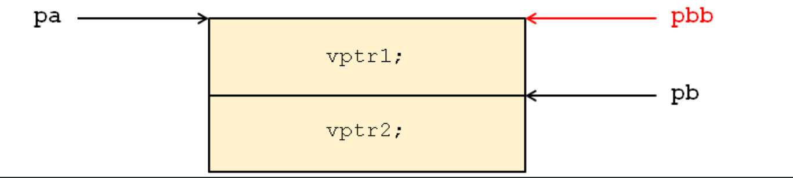

# 多态

## 定义

多态按字面的意思就是多种形态。当类之间存在层次结构，并且类之间是通过继承关联时，就会用到多态。通俗来讲就是：有一个动物的大类，然后他有一个吃饭的特性函数，我们在使用的时候通过动物继承出了老虎、马、兔子等等派生类，他们吃的食物不同，因此这些派生类的吃饭的特性函数并重写了一遍，而最后当我们调用吃饭这个函数时，系统就会根据我们调用的对象来判断具体调用那个派生类的吃饭函数<br><br>

C++ 多态意味着调用成员函数时，会根据调用函数的对象的类型来执行不同的函数。上例子：

```c++
#include <iostream>

using namespace std;

class A
{
public:
 void virtual prt()
 {
  cout << "打印A" << endl;
 }
};

class B : public A
{
public:
 void prt()
 {
  cout << "打印B" << endl;
 }
};

class C : public B
{
public:
 void prt()
 {
  cout << "打印C" << endl;
 }
};

int main(void)
{
 A* a=(A*)new B();
 a->prt();
 C* c=(C*)new B();
 c->prt();
 return 0;
}
```

运行结果：

```shell
打印B
打印B
```

## 形成条件

有上述例子可以总结形成多态必须具备三个条件：

1. 必须存在继承关系；

2. 继承关系必须有同名虚函数（其中虚函数是在基类中使用关键字Virtual声明的函数，在派生类中重新定义基类中定义的虚函数时，会告诉编译器不要静态链接到该函数）；

3. 存在基类类型的指针或者引用，通过该指针或引用调用虚函数；（上例子实测使用其派生类类型的指针也能正确调用）

## 由来，作用，好处

从网上嫖的，看看就好。

1. 可替换性。多态对已存在代码具有可替换性。例如，多态对圆Circle类工作，对其他任何圆形几何体，如圆环，也同样工作。
2. 可扩充性。多态对代码具有可扩充性。增加新的子类不影响已存在类的多态性、继承性，以及其他特性的运行和操作。实际上新加子类更容易获得多态功能。例如，在实现了圆锥、半圆锥以及半球体的多态基础上，很容易增添球体类的多态性。
3. 接口性。多态是父类通过方法签名，向子类提供了一个共同接口，由子类来完善或者覆盖它而实现的。
4. 灵活性。它在应用中体现了灵活多样的操作，提高了使用效率。
5. 简化性。多态简化对应用软件的代码编写和修改过程，尤其在处理大量对象的运算和操作时，这个特点尤为突出和重要。

## 回忆重写、重载、重定义

c++有重载、重写、重定义三个概念。

- 重载：要求两个函数的参数列表必须不同，但是不要求这两个函数必须是虚函数，两者在同一作用域，它是允许有多个同名的函数，而这些函数的参数列表不同，允许参数个数不同，参数类型不同，或者两者都不同。编译器会根据这些函数的不同列表，将同名的函数的名称做修饰，从而生成一些不同名称的预处理函数，来实现同名函数调用时的重载问题。这并不是多态的体现。
- 重写：子类中重写父类的虚函数，要求必须是虚函数且父类的虚函数必须有virtual关键字，函数的参数列表和返回值也必须相同。但子类中重写后的虚函数的访问修饰符可以不同。
- 重定义(隐藏)：其也是描述分别位于父类与子类中的同名函数的，但返回值可以不同。如果参数列表不同，这时子类中重定义的函数不论是否有virtual关键字，都会隐藏父类的同名函数。如果参数列表相同，但父类中的同名函数没有virtual关键字修饰，此时父类中的函数仍然被隐藏。

简单来讲：

- 重载：两个同名但不完全相同的函数，但实际是无关系的，相当于编号为1的李三和编号为2的李三。
- 重写：同名且外表完全相同的函数，有很多个李三，根据班级找人，对于当前对象来说，本派生类重写后的函数将父类的函数覆盖了。
- 重定义：把以前的函数删掉，重新定义一个，旧的函数从此开始已经不在了。

## 虚函数

虚函数 是在基类中使用关键字 virtual 声明的函数。在派生类中重写基类中定义的虚函数时，会告诉编译器不要静态链接到该函数。<br><br>

C++规定，当一个成员函数被声明为虚函数后，其派生类中的同名函数都自动成为虚函数。<br><br>

我们想要的是在程序中任意点可以根据所调用的对象类型来选择调用的函数，这种操作被称为动态链接，或后期绑定。

### 半虚函数和纯虚函数

我们以上的例子均是半虚函数，我们在基类中定义了函数，并写出了函数体，而在派生类中，可以重写该函数也可以不写，不写则调用基类中写的。<br><br>

纯虚函数则是不在基类中编写函数体，要求派生类必须实现该方法。例子：

```c++
#include <iostream>

using namespace std;

class A
{
public:
 void virtual prt() = 0;
};

class B : public A
{
public:
 //不实现prt函数会报错：纯虚拟 函数 "A::prt" 没有强制替代项
 void prt()
 {
  cout << "打印B" << endl;
 }
};

class C : public A
{
public:
 void prt()
 {
  cout << "打印C" << endl;
 }
};

int main(void)
{
 A *a = (A *)new B();
 a->prt();
 a = (A *)new C();
 a->prt();
 return 0;
}
```

运行结果：

```shell
打印B
打印C
```

注意在一个类中如果存在未定义的虚函数，即纯虚函数，那么不能直接使用该类的实例，可以理解因为未定义 virtual 函数，其类是抽象的，无法实例化。以上是针对虚函数而言，普通的函数，即使我们只声明，不定义，也不会产生上述不可用的问题。

### 构造、拷贝构造、析构函数

构造函数和拷贝构造函数不可以是虚函数，析构函数可以且常常是虚函数，当有继承时析构函数必须是虚函数。具体查看继承一节。

### 友元函数的虚拟问题

友元不是成员函数，只有成员函数才可以是虚拟的，因此友元不能是虚拟函数。但可以通过让友元函数调用虚拟成员函数来解决友元的虚拟问题。

```c++
#include <iostream>

using namespace std;

class A
{
public:
 void serName(char n)
 {
  name = n;
 }
 virtual void prt()
 {
  cout << "A:" << name << endl;
 };
 friend void p(A *obj);

protected:
 char name;
};

void p(A *obj)
{
 cout << "调用p函数：" << endl;
 obj->prt();
}

class B : public A
{
public:
 void prt()
 {
  cout << "B:" << name << endl;
 }
};

int main(void)
{
 A *b=new B();
 b->serName('r');
 p(b);
 return 0;
}
```

运行结果：

```shell
调用p函数：
B:r
```

### 内联函数的虚拟问题

内联函数可以声明为虚函数，但编译器便不会在使这个函数成为内联函数（inline为建议而不是强制）

```c++
#include <iostream>

using namespace std;

// 基类1
class A
{
public:
 virtual inline void prt()
 {
  cout << "A" << endl;
 }
};

// 基类2
class B : public A
{
public:
 inline void prt()
 {
  cout << "B" << endl;
 }
};

int main(void)
{
 B b;
 b.prt();
 return 0;
}
```

运行结果：

```shell
B
```

### 静态成员的虚拟问题

仅非静态成员函数可以是虚拟的，static成员，不管是static变量还是static方法，都是属于类的，不与任何对象实例相关联，而多态最起码得要有多个对象的存在，根据不同对象处理不同，从而体现出多态，所有静态成员没有多态特性。

## 虚表指针

如果类中存在虚函数，那么编译器在编译时会给该类分配一个虚函数表。在程序运行时，每定义一个对象，则会生成一个指针（64位机为8 字节），指针里存放的是虚函数表的地址，这个指针也称为“虚表指针”（__vfptr）<br><br>

在通过指针或引用调用虚函数时，会通过虚表指针去虚函数表中查找。所以普通对象调用虚函数比指针引用调用虚函数要慢。<br><br>

### 扩展：虚函数表的重复问题

问题来了，A 类中有虚函数，A 的对象就会有一个虚表指针，B 类中有虚函数，B 的对象就会有一个虚表指针，C 类继承了 A 和 B,那么 C 类对象会有几个虚表指针？

```c++
#include <iostream>

using namespace std;

// 基类1
class A
{
public:
 virtual void prtA()
 {
  cout << "A" << endl;
 }
};

// 基类2
class B
{
 virtual void prtB()
 {
  cout << "B" << endl;
 }
};

class C : public A, public B
{
};

int main(void)
{
 cout << "A:" << sizeof(A) << endl;
 cout << "B:" << sizeof(B) << endl;
 cout << "C:" << sizeof(C) << endl;
 return 0;
}
```

运行结果：

```shell
A:8
B:8
C:16
```

很明显C类中包含了A类和B类的两个虚表指针，那么出现了两个虚表指针后会不会就找不到了呢？会的：

```c++
#include <iostream>

using namespace std;

// 基类1
class A
{
public:
 virtual void prtA()
 {
  cout << "A" << endl;
 }
};

// 基类2
class B
{
public:
 virtual void prtB()
 {
  cout << "B" << endl;
 }
};

class C : public A, public B
{
};

int main(void)
{
 C *c = new C();
 A *a = (A *)c;
 B *b = (B *)c;
 a->prtA();
 // a->prtB();找不到
 // b->prtA();找不到
 b->prtB();
 c->prtA();
 c->prtB();
 cout << a << endl;
 cout << b << endl;
 cout << c << endl;
 return 0;
}
```

运行结果：

```shell
A
B
A
B
0x5646179e8eb0
0x5646179e8eb8
0x5646179e8eb0
```

可以看到，a 和 b 指向的地址是不同的，他们分别指向自家的虚表指针，a 按照 A 类的虚函数表，再找到对应虚函数进行调用，那么 a 就找不到 b 中的虚函数，b 按照 B 类的虚函数表，再找到对应虚函数进行调用，b 也找不到 a 中的虚函数，我在网上找到了一张图，下图中 pa 就是上述代码中的 a 的位置，pb 指向的就是上述代码中的 b 的位置：



即使我们使用转换将 a 转换为 B 类型，访问的仍然是 A 类中的函数，只是名字变成 B 的了，按照顺序来调用 A 类中的虚函数。

```c++
#include <iostream>

using namespace std;

// 基类1
class A
{
public:
 virtual void prtA1(char i)
 {
  cout << "A1" << endl;
 }
 virtual void prtA2()
 {
  cout << "A2" << endl;
 }
};

// 基类2
class B
{
public:
 virtual void prtB1(int a)
 {
  cout << "B1" << endl;
 }
 virtual void prtB2(double a)
 {
  cout << "B2" << endl;
 }
};

class C : public A, public B
{
};

int main(void)
{
 C *c = new C();
 A *a = (A *)c;
 B *e = (B *)a;
 // a->prtB();找不到
 // e->prtA();找不到
 e->prtB1(4);
 e->prtB2(4.00);
 cout << a << endl;
 cout << e << endl;
 return 0;
}
```

运行结果：

```shell
A1
A2
0x562c0057ceb0
0x562c0057ceb0
```

这时就需要使用强制转换 dynamic_cast：

```c++
#include <iostream>

using namespace std;

// 基类1
class A
{
public:
 virtual void prtA()
 {
  cout << "A" << endl;
 }
};

// 基类2
class B
{
public:
 virtual void prtB()
 {
  cout << "B" << endl;
 }
};

class C : public A, public B
{
};

int main(void)
{
 C *c = new C();
 A *a = (A *)c;
 B *b = (B *)c;
 A *d = dynamic_cast<A *>(b);
 B *e = dynamic_cast<B *>(a);
 // a->prtB();找不到
 e->prtB();
 // b->prtA();找不到
 d->prtA();
 cout << a << endl;
 cout << e << endl;
 cout << b << endl;
 cout << d << endl;
 return 0;
}
```

运行结果：

```shell
B
A
0x556ab18a6eb0
0x556ab18a6eb8
0x556ab18a6eb8
0x556ab18a6eb0
```
