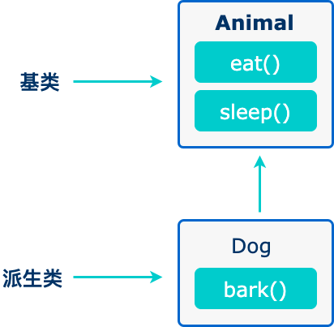

# 继承

## 定义

当创建一个类时，您不需要重新编写新的数据成员和成员函数，只需指定新建的类继承了一个已有的类的成员即可。这个已有的类称为基类，新建的类称为派生类。<br><br>

继承代表了 is a 关系。例如，哺乳动物是动物，狗是哺乳动物，因此，狗是动物，等等。<br><br>



## 由来

面向对象程序设计中最重要的一个概念是继承。继承允许我们依据另一个类来定义一个类，这使得创建和维护一个应用程序变得更容易。这样做，也达到了重用代码功能和提高执行效率的效果。

## 初识

一个类可以派生自多个类，这意味着，它可以从多个基类继承数据和函数。定义一个派生类，我们使用一个类派生列表来指定基类。类派生列表以一个或多个基类命名，形式如下：

```c++
#include <iostream>

using namespace std;

// 基类1
class Shape
{
public:
 void setWidth(int w)
 {
  width = w;
 }
 void setHeight(int h)
 {
  height = h;
 }

protected:
 int width;
 int height;
};

// 基类2
class Color
{
public:
 void setColor(int c)
 {
  color = c;
 }

public:
 int color;
};

// 派生类
class Rectangle : public Shape, public Color
//如果省略public则默认为private,即：class Rectangle : Shape=class Rectangle : private Shape
{
public:
 int getArea()
 {
  return (width * height);
 }
};

int main(void)
{
 Rectangle Rect;

 Rect.setWidth(5);
 Rect.setHeight(7);
 Rect.setColor(3);

 cout << "面积：" << Rect.getArea() << " 颜色：" << Rect.color << endl;

 return 0;
}
```

运行结果：

```shell
面积：35 颜色：3
```

继承时使用了private（效果和类中定义变量类型相同）：

```c++
#include <iostream>

using namespace std;

// 基类1
class Shape
{
public:
 void setWidth(int w)
 {
  width = w;
 }
 void setHeight(int h)
 {
  height = h;
 }

protected:
 int width;
 int height;
};

// 基类2
class Color
{
public:
 void setColor(int c)
 {
  color = c;
 }

public:
 int color;
};

// 派生类
class Rectangle : Shape, Color
//如果省略public则默认为private,即：class Rectangle : Shape=class Rectangle : private Shape
{
public:
 void set(int w, int h, int c)
 {
  setWidth(w);
  setHeight(h);
  setColor(c);
 }
 int getArea()
 {
  return (width * height);
 }
 int getColor()
 {
  return color;
 }
};

int main(void)
{
 Rectangle Rect;

 /* Rect.setWidth(5);  不可访问
 Rect.setHeight(7);
 Rect.setColor(3);
 Rect.color; */

 Rect.set(5, 7, 3);

 cout << "面积：" << Rect.getArea() << " 颜色：" << Rect.getColor() << endl;

 return 0;
}
```

运行结果：

```shell
面积：35 颜色：3
```

## 在基类中设置访问控制

派生类可以访问基类中所有的非私有成员。因此基类成员如果不想被派生类的成员函数访问，则应在基类中声明为 private。继承类时也是相同，对比如下：
|访问|public|protected|private|
|:----:|:----:|:----:|:----:|
|同一个类|yes|yes|yes|
|派生类|yes|yes|no|
|外部的类|yes|no|no|

### 继承类型

当一个类派生自基类，该基类可以被继承为 public、protected 或 private 几种类型。<br><br>

几乎不使用 protected 或 private 继承，通常使用 public 继承。当使用不同类型的继承时，遵循以下几个规则：

- 公有继承（public）：当一个类派生自公有基类时，基类的公有成员也是派生类的公有成员，基类的保护成员也是派生类的保护成员，基类的私有成员不能直接被派生类访问，但是可以通过调用基类的公有和保护成员来访问。
- 保护继承（protected）： 当一个类派生自保护基类时，基类的公有和保护成员将成为派生类的保护成员。
- 私有继承（private）：当一个类派生自私有基类时，基类的公有和保护成员将成为派生类的私有成员。

一个派生类继承了所有的基类方法，但下列函数并不继承：

- 基类的构造函数、析构函数和拷贝构造函数。
- 基类的重载运算符。
- 基类的友元函数。

### 构造函数的使用问题

在初始化列表中使用基类的构造函数：

```c++
#include <iostream>

using namespace std;

// 基类1
class People
{
public:
 People(char n, int a) : name(n), age(a)
 {
  cout << "创建了一个people" << endl;
 }
 void setName(char n)
 {
  name = n;
 }
 void setAge(int a)
 {
  age = a;
 }

public:
 char name;
 int age;
};

// 基类2
class Student : public People
{
public:
 Student(char n, int a, int g) : People(n, a)
 {
  //People(n, a);报错
  grade = g;
 }
 void setGrade(int g)
 {
  grade = g;
 }

public:
 int grade;
};

int main(void)
{
 Student('r', 14, 1);
 return 0;
}
```

运行结果：

```shell
创建了一个people
```

解释：（基于我的理解，可能有错）为了确保调用派生类的构造函数的时候，已经调用过基类的某个构造函数，完成了派生类的继承自基类部分的数据成员的初始化。即调用顺序是：先调用基类的构造函数，再调用派生类的。也就是说，在派生类进入构造函数的函数体以后，基类的构造函数默认已经是完成的了，所以，如果基类不存在默认构造函数，或构造函数需要参数且没有默认值，则派生类在进行构造函数的时候，必须将基类的构造函数写在初始化列表中的，否则编译不会通过。

### 析构函数在有继承时需要注意的点

还记得在构造函数一章讲的吗，构造函数不可以是虚函数，而析构函数可以且常常是虚函数。而当类有继承时，析构函数必须为虚函数。如果不是虚函数，则使用时可能存在内存泄漏的问题。<br><br>

现在将为什么有类继承时必须是虚函数，废话不多说，直接上代码：

```c++
#include <iostream>

using namespace std;

class A
{
public:
 ~A()
 {
  cout << "A的虚构函数。" << endl;
 }
};

class B : public A
{
public:
 ~B()
 {
  cout << "B的虚构函数。" << endl;
 }
};

int main(void)
{
 B b;
 return 0;
}
```

运行结果：

```shell
B的虚构函数。
A的虚构函数。
```

哎，你会发现，没啥大问题呀，我新建一个B,B里面有A的内容和B的内容，在销毁时，分别调用B和A的析构函数，是的，确实没问题。。。但是下面这种情况就有问题了：

```c++
#include <iostream>

using namespace std;

class A
{
public:
 ~A()
 {
  cout << "A的虚构函数。" << endl;
 }
};

class B : public A
{
public:
 ~B()
 {
  cout << "B的虚构函数。" << endl;
 }
};

int main(void)
{
 A *b = (A *)new B();
 delete (b);
 return 0;
}
```

```shell
A的虚构函数。
```

完蛋了不是，系统认为他是A,所以直接调用了A的虚构函数，即使对象的类型不是A。所以需要虚函数了。

```c++
#include <iostream>

using namespace std;

class A
{
public:
 virtual ~A()
 {
  cout << "A的虚构函数。" << endl;
 }
};

class B : public A
{
public:
 ~B()
 {
  cout << "B的虚构函数。" << endl;
 }
};

int main(void)
{
 A *b = (A *)new B();
 delete (b);
 return 0;
}
```

运行结果：

```shell
B的虚构函数。
A的虚构函数。
```

接下来回忆一下虚函数的作用你就知道了，虚函数在运行时才可以明确调用对象，根据传入的对象类型来调用函数，例如通过父类的指针或者引用来调用它的时候可以变成调用子类的那个成员函数。<br><br>

当然需要是父类指针：

```c++
#include <iostream>

using namespace std;

class A
{
public:
 virtual ~A()
 {
  cout << "A的虚构函数。" << endl;
 }
};

class B : public A
{
public:
 ~B()
 {
  cout << "B的虚构函数。" << endl;
 }
};

int main(void)
{
 char *b = (char *)new B();
 delete (b);
 return 0;
}
```

运行结果：

```shell

```

至于构造函数，它是在创建对象时自己主动调用的，不可能通过父类的指针或者引用去调用，所以没有必要成为虚函数。

### 拷贝构造函数

具体和构造函数相同，这里只是介绍一下子类的拷贝构造函数怎么实现：

```c++
#include <iostream>

using namespace std;

class A
{
public:
 A(int a) : age(a)
 {
  cout << "A的构造函数。" << endl;
 }
 A(const A &obj)
 {
  cout << "A的拷贝构造函数。" << endl;
 }

public:
 int age;
};

class B : public A
{
public:
 B(int a, char n) : A(a), name(n)
 {
  cout << "B的构造函数。" << endl;
 }
 B(const B &obj) : A(obj.age), name(obj.name)
 {
  cout << "B的拷贝构造函数。" << endl;
 }

public:
 char name;
};

int main(void)
{
 B b1(20, 'r');
 B b2 = b1;
 cout << "b2 name:" << b2.name << " age:" << b2.age << endl;
 return 0;
}
```

运行结果：

```shell
A的构造函数。
B的构造函数。
A的构造函数。
B的拷贝构造函数。
b2 name:r age:20
```

### 重载运算符

在C++ Primer Plus上面说重载的赋值运算符不可以继承，但是编译器并不听这一套，实测g++编译器是可以继承的：

```c++
#include <iostream>

using namespace std;

class A
{
public:
 A(int a) : age(a)
 {
  cout << "A的构造函数。" << endl;
 }
 A(const A &obj)
 {
  cout << "A的拷贝构造函数。" << endl;
 }
 void operator=(const A &obj)
 {
  age = obj.age;
  cout << "A的重写赋值运算符。" << endl;
 }

public:
 int age;
};

class B : public A
{
public:
 B(int a, char n) : A(a), name(n)
 {
  cout << "B的构造函数。" << endl;
 }
 B(const B &obj) : A(obj.age), name(obj.name)
 {
  cout << "B的拷贝构造函数。" << endl;
 }

public:
 char name;
};

int main(void)
{
 B b1(20, 'r');
 B b2(12, 'u');
 b2 = b1;
 cout << "b2 name:" << b2.name << " age:" << b2.age << endl;
 return 0;
}
```

运行结果：

```shell
A的构造函数。
B的构造函数。
A的构造函数。
B的构造函数。
A的重写赋值运算符。
b2 name:r age:20
```

### 友元类与友元函数的继承和传递问题

#### 友元类

此小节说的是啥呢，就是如果有一个类a,他赋予了类b为自己的友元类，那么我有一个类c继承了类b,那么类c还是不是类a的友元类呢？<br><br>

官方来说（c++ primer中文版（第四版）575页）：友元关系是不能继承的，可能原因是，我和你是朋友，但你儿砸不能和我称兄道弟的。<br><br>

然鹅，编译器并不咋俺规范来，在g++编译器下测试，是可以继承的，并且查询网上，貌似vs编译器也阔以，可能原因是我把我的财产给你来继承，如果你不继承，你儿砸也是可以的嘛。<br><br>

```c++
#include <iostream>

using namespace std;

class A
{
public:
 void setName(char n)
 {
  name = n;
 }
 void setAge(int a)
 {
  age = a;
 }
 friend class B;

public:
 char name;
 int age;
};

class B
{
public:
 void getB(const A &obj)
 {
  cout << "B可以访问A的东西,name:" << obj.name << " age:" << obj.age << endl;
 };
};

class C : public B
{
public:
 void getC(const A &obj)
 {
  cout << "C可以访问A的东西,name:" << obj.name << " age:" << obj.age << endl;
 };
};

int main(void)
{
 A a;
 a.setName('r');
 a.setAge(20);
 B b;
 b.getB(a);
 C c;
 c.getB(a);
 c.getC(a);
 return 0;
}
```

运行结果：

```shell
B可以访问A的东西,name:r age:20
B可以访问A的东西,name:r age:20
C可以访问A的东西,name:r age:20
```

#### 友元函数

同样滴，友元函数实测也是可以继承的：

```c++
#include <iostream>

using namespace std;

class A
{
public:
 void serName(char n)
 {
  name = n;
 }
 friend void prt(A obj);

private:
 char name;
};
void prt(A obj)
{
 cout << "A:" << obj.name << endl;
}
class B : public A
{
public:
};

int main(void)
{
 B b;
 b.serName('r');
 prt(b);
 return 0;
}
```

运行结果：

```shell
A:r
```

## 多继承

多继承即一个子类可以有多个父类，它继承了多个父类的特性。形式如下：

```c++
class Rectangle :public Shape,public Color
```

需注意public这些修饰符作用域只有后面的一个，即

```c++
class Rectangle :public Shape, Color
```

与下面这个相等

```c++
class Rectangle :public Shape, private Color
```

### 环继承问题

设想一个问题：A继承自D，B也继承自D，C继承了A和B，这将导致D被创建了两次。例如：

```c++
#include <iostream>

using namespace std;

// 基类1
class People
{
public:
 People()
 {
  cout << "创建了一个people" << endl;
 }
 void setName(char n)
 {
  name = n;
 }
 void setAge(int a)
 {
  age = a;
 }

public:
 char name;
 int age;
};

// 基类2
class Student : public People
{
public:
 void setGrade(int g)
 {
  grade = g;
 }

public:
 int grade;
};

// 基类3
class Boy : public People
{
public:
 void setColor(int c)
 {
  color = c;
 }

public:
 //肤色
 int color;
};

// 派生类
class CollegeStudents : public Student, public Boy
{
};

int main(void)
{
 CollegeStudents rui;
 rui.setGrade(2);
 rui.setColor(1);
 //rui.name = 'r'; 报错：char People::name "CollegeStudents::name" 不明确
 return 0;
}
```

运行结果：

```shell
创建了一个people
创建了一个people
```

可见，创建大学生这个对象时，创建了两个people对象，要想解决这个问题，需要使用虚继承：

```c++
#include <iostream>

using namespace std;

// 基类1
class People
{
public:
 People()
 {
  cout << "创建了一个people" << endl;
 }
 void setName(char n)
 {
  name = n;
 }
 void setAge(int a)
 {
  age = a;
 }

public:
 char name;
 int age;
};

// 基类2
class Student : virtual public People
{
public:
 void setGrade(int g)
 {
  grade = g;
 }

public:
 int grade;
};

// 基类3
class Boy : virtual public People
{
public:
 void setColor(int c)
 {
  color = c;
 }

public:
 //肤色
 int color;
};

// 派生类
class CollegeStudents : public Student, public Boy
{
};

int main(void)
{
 CollegeStudents rui;
 rui.setGrade(2);
 rui.setColor(1);
 rui.name = 'r';
 return 0;
}
```

运行结果：

```shell
创建了一个people
```

当然，如果是需要两个People对象，那么也可以访问：

```c++
int main(void)
{
 CollegeStudents rui;
 rui.setGrade(2);
 rui.setColor(1);
 // rui.name = 'r'; 报错：char People::name "CollegeStudents::name" 不明确
 rui.Student::name = 'r';
 rui.Boy::name = 'u'; //可以依据此来分辨不同的People
 return 0;
}
```

注意，此处我们是想不重复继承People,所以虚继承关键字要写在Student、Boy的定义里面，而不能写在大学生继承里面，即下面这种方法是不能达到效果的：

```c++
// 基类1
class People
{};

// 基类2
class Student : public People
{};

// 基类3
class Boy : public People
{};

// 派生类
class CollegeStudents : virtual public Student, virtual public Boy
{};
```

### 构造函数的顺序问题

继承的多个基类的构造函数调用的顺序和继承的顺序是相同的，即使使用了初始化列表。

```c++
#include <iostream>

using namespace std;

// 基类1
class People
{
public:
 People()
 {
  cout << "创建了一个people" << endl;
 }
 void setName(char n)
 {
  name = n;
 }
 void setAge(int a)
 {
  age = a;
 }

public:
 char name;
 int age;
};

// 基类2
class Student : public People
{
public:
 Student()
 {
  cout << "创建了一个student." << endl;
 }
 void setGrade(int g)
 {
  grade = g;
 }

public:
 int grade;
};

// 基类3
class Boy : public People
{
public:
 Boy()
 {
  cout << "创建了一个boy." << endl;
 }
 void setColor(int c)
 {
  color = c;
 }

public:
 //肤色
 int color;
};

// 派生类
class CollegeStudents : public Student, public Boy
{
};

int main(void)
{
 CollegeStudents rui;
 return 0;
}
```

运行结果：

```shell
创建了一个people
创建了一个student.
创建了一个people
创建了一个boy.
```

```c++
#include <iostream>

using namespace std;

// 基类1
class People
{
public:
 People()
 {
  cout << "创建了一个people" << endl;
 }
 void setName(char n)
 {
  name = n;
 }
 void setAge(int a)
 {
  age = a;
 }

public:
 char name;
 int age;
};

// 基类2
class Student : public People
{
public:
 Student(int g) : grade(g)
 {
  cout << g << "创建了一个student." << endl;
 }
 void setGrade(int g)
 {
  grade = g;
 }

public:
 int grade;
};

// 基类3
class Boy : public People
{
public:
 Boy(int c) : color(c)
 {
  cout << c << "创建了一个boy." << endl;
 }
 void setColor(int c)
 {
  color = c;
 }

public:
 //肤色
 int color;
};

// 派生类
class CollegeStudents : public Boy, public Student
{
public:
 CollegeStudents(int g, int c) : Student(g), Boy(c){};
};

int main(void)
{
 CollegeStudents rui(1, 2);
 return 0;
}
```

运行结果：

```shell
创建了一个people
2创建了一个boy.
创建了一个people
1创建了一个student.
```

### 基类变量或函数重名问题

基类中变量出现重名的问题和环继承相似，在派生类中不能直接调用，如果需要保留两个内容则可以加上作用域使用，如果只用保留一份则可以在两个基类之上建立新的父类，然后使用虚继承。函数相同。

```c++
#include <iostream>

using namespace std;

// 基类1
class People
{
public:
 People()
 {
  cout << "创建了一个people" << endl;
 }
 void setName(char n)
 {
  name = n;
 }
 void setAge(int a)
 {
  age = a;
 }

public:
 char name;
 int age;
};

// 基类2
class Student : public People
{
public:
 void setGrade(int g)
 {
  grade = g;
 }

public:
 int grade;
};

// 基类3
class Boy : public People
{
public:
 void setGrade(int g)
 {
  grade = g;
 }

public:
 int grade;
};

// 派生类
class CollegeStudents : public Boy, public Student
{
};

int main(void)
{
 CollegeStudents rui;
 rui.Boy::setGrade(2);
 rui.Student::setGrade(1);
 cout << "boy:" << rui.Boy::grade << " student:" << rui.Student::grade << endl;
 return 0;
}
```

运行结果：

```shell
创建了一个people
创建了一个people
boy:2 student:1
```

```c++
#include <iostream>

using namespace std;

// 基类1
class People
{
public:
 People()
 {
  cout << "创建了一个people" << endl;
 }
 void setName(char n)
 {
  name = n;
 }
 void setAge(int a)
 {
  age = a;
 }
 void setGrade(int g)
 {
  grade = g;
 }

public:
 char name;
 int age;
 int grade;
};

// 基类2
class Student : virtual public People
{
};

// 基类3
class Boy : virtual public People
{
};

// 派生类
class CollegeStudents : public Boy, public Student
{
};

int main(void)
{
 CollegeStudents rui;
 rui.setGrade(2);
 cout << "grade:" << rui.grade << endl;
 return 0;
}
```

运行结果：

```shell
创建了一个people
grade:2
```

### 扩展1：虚函数

多态性可以简单地概括为“一个接口，多种方法”，程序在运行时才决定调用的函数，它是面向对象编程领域的核心概念。C++多态性是通过虚函数来实现的,在运行时才可以明确调用对象，根据传入的对象类型来调用函数。<br><br>

c++有重载、重写、重定义三个概念。

- 重载：要求两个函数的参数列表必须不同，但是不要求这两个函数必须是虚函数，它是允许有多个同名的函数，而这些函数的参数列表不同，允许参数个数不同，参数类型不同，或者两者都不同。编译器会根据这些函数的不同列表，将同名的函数的名称做修饰，从而生成一些不同名称的预处理函数，来实现同名函数调用时的重载问题。这并不是多态的体现。
- 重写：子类中重写父类的虚函数，要求必须是虚函数且父类的虚函数必须有virtual关键字，函数的参数列表和返回值也必须相同。但子类中重写后的虚函数的访问修饰符可以不同。
- 重定义：其也是描述分别位于父类与子类中的同名函数的，但返回值可以不同。如果参数列表不同，这时子类中重定义的函数不论是否有virtual关键字，都会隐藏父类的同名函数。如果参数列表相同，但父类中的同名函数没有virtual关键字修饰，此时父类中的函数仍然被隐藏。

### 扩展2：虚函数表的重复问题

如果类中存在虚函数，那么编译器在编译时会给该类分配一个虚函数表。在程序运行时，每定义一个对象，则会生成一个指针（8 字节），指针里存放的是虚函数表的地址，这个指针也称为“虚表指针”（__vfptr）<br><br>

那么，A类中有虚函数，A的对象就会有一个虚表指针，B类中有虚函数，B的对象就会有一个虚表指针，C类继承了A和B,那么C类对象就会有两个虚表指针。

```c++
#include <iostream>

using namespace std;

// 基类1
class A
{
public:
 virtual void prtA()
 {
  cout << "A" << endl;
 }
};

// 基类2
class B
{
 virtual void prtB()
 {
  cout << "B" << endl;
 }
};

class C : public A, public B
{
};

int main(void)
{
 cout << "A:" << sizeof(A) << endl;
 cout << "B:" << sizeof(B) << endl;
 cout << "C:" << sizeof(C) << endl;
 return 0;
}
```

运行结果：

```shell
A:8
B:8
C:16
```

出现了两个虚表指针会不会就找不到了呢？会的：

```c++
#include <iostream>

using namespace std;

// 基类1
class A
{
public:
 virtual void prtA()
 {
  cout << "A" << endl;
 }
};

// 基类2
class B
{
public:
 virtual void prtB()
 {
  cout << "B" << endl;
 }
};

class C : public A, public B
{
};

int main(void)
{
 C *c = new C();
 A *a = (C *)c;
 B *b = (C *)c;
 a->prtA();
 // a->prtB();找不到
 // b->prtA();找不到
 b->prtB();
 c->prtA();
 c->prtB();
 cout << a << endl;
 cout << b << endl;
 cout << c << endl;
 return 0;
}
```

运行结果：

```shell
A
B
A
B
0x5646179e8eb0
0x5646179e8eb8
0x5646179e8eb0
```
