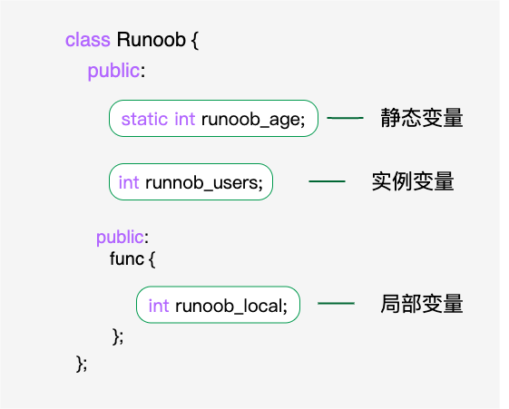

# 静态成员

## 静态变量

在函数内部定义的变量，当程序执行到它的定义处时，编译器为它分配空间，函数在栈上分配的空间在此函数执行结束时会释放掉，这样就产生了一个问题: 如果想将函数中此变量的值保存至下一次调用时，如何实现？ 最容易想到的方法是定义为全局的变量，但定义一个全局变量有许多缺点，最明显的缺点是破坏了此变量的访问范围（使得在此函数中定义的变量，不仅仅只受此函数控制）。所以产生了static，静态变量的作用范围不变，但是生命周期是从第一次定义直至程序结束。<br><br>

```c++
#include <iostream>
using namespace std;
void f1(){
    static int a=0;
    cout << a<< endl;
    a++;
}
int main(int argc, char const *argv[])
{
    f1();
    f1();
    f1();
    f1();
    f1();
    return 0;
}
```

运行结果：

```shell
0
1
2
3
4
```

另外，在 C++ 中，需要一个数据对象为整个类而非某个对象服务,同时又力求不破坏类的封装性,即要求此成员隐藏在类的内部，对外不可见时，可将其定义为静态成员。

## 静态成员

当将类的某个数据成员声明为static时，该静态数据成员只能被定义一次，而且要被同类的所有对象共享。各个对象都拥有类中每一个普通数据成员的副本，但静态数据成员只有一个实例存在，与定义了多少类的对象无关。

静态成员变量在类中仅仅是声明，没有定义，所以要在类的外面定义，实际上是给静态成员变量分配内存。如果不加定义就会报错，初始化是赋一个初始值，而定义是分配内存。

```c++
#include <iostream>

using namespace std;

class Box
{
public:
 static int objectCount;
 // 构造函数定义
 Box(double l = 2.0, double b = 2.0, double h = 2.0)
 {
  cout << "构造函数" << endl;
  length = l;
  breadth = b;
  height = h;
  // 每次创建对象时增加 1
  objectCount++;
 }
 //计算体积
 double Volume()
 {
  return length * breadth * height;
 }

private:
 double length; // 长度
 double breadth; // 宽度
 double height; // 高度
};

//定义并初始化类 Box 的静态成员
int Box::objectCount = 0;
//也可这样 定义却不初始化
//int Box::objectCount;

int main(void)
{
 Box Box1(3.3, 1.2, 1.5); // 声明 box1
 Box Box2(8.5, 6.0, 2.0); // 声明 box2

 // 输出对象的总数
 cout << "对象数：" << Box::objectCount << endl;

 Box::objectCount = 4;

 // 输出对象的总数
 cout << "对象数：" << Box::objectCount << endl;

 return 0;
}
```

运行结果：

```shell
构造函数
构造函数
对象数：2
对象数：4
```

### 扩展：静态整形常量和静态非整形常量

#### 由来

如果我希望一个类中，具有一些常量，但是不希望常量在各个类的对象中有多份拷贝（占用不必要的内存）

```c++
#include <iostream>

using namespace std;

class Box
{
public:
 static int objectCount;
 static const int i1 = 1;
 // static const float i2=1.0;报错
 static const float i2;
 // 构造函数定义
 Box(double l = 2.0, double b = 2.0, double h = 2.0)
 {
  cout << "构造函数" << endl;
  length = l;
  breadth = b;
  height = h;
  // 每次创建对象时增加 1
  objectCount++;
 }
 //计算体积
 double Volume()
 {
  return length * breadth * height;
 }

private:
 double length; // 长度
 double breadth; // 宽度
 double height; // 高度
};

//定义并初始化类 Box 的静态成员
int Box::objectCount = 0;
const float Box::i2 = 2.0;

int main(void)
{
 return 0;
}
```

## 静态成员函数

如果把函数成员声明为静态的，就可以把函数与类的任何特定对象独立开来。静态成员函数即使在类对象不存在的情况下也能被调用，静态函数只要使用类名加范围解析运算符 :: 就可以访问。<br><br>

静态成员函数只能访问静态成员数据、其他静态成员函数和类外部的其他函数。<br><br>

静态成员函数与普通成员函数的区别：

- 静态成员函数没有 this 指针，只能访问静态成员（包括静态成员变量和静态成员函数）。
- 普通成员函数有 this 指针，可以访问类中的任意成员；而静态成员函数没有 this 指针。

静态成员函数有一个类范围，可以使用静态成员函数来判断类的某些对象是否已被创建。<br><br>

```c++
#include <iostream>
 
using namespace std;
 
class Box
{
   public:
      static int objectCount;
      // 构造函数定义
      Box(double l=2.0, double b=2.0, double h=2.0)
      {
         cout <<"构造函数" << endl;
         length = l;
         breadth = b;
         height = h;
         // 每次创建对象时增加 1
         objectCount++;
      }
   //计算体积
      double Volume()
      {
         return length * breadth * height;
      }
   //获取已创建对象
      static int getCount()
      {
         return objectCount;
      }
   private:
      double length;     // 长度
      double breadth;    // 宽度
      double height;     // 高度
};
 
// 初始化类 Box 的静态成员
int Box::objectCount = 0;
 
int main(void)
{
  
   // 在创建对象之前输出对象的总数
   cout << "对象数：" << Box::getCount() << endl;
 
   Box Box1(3.3, 1.2, 1.5);    // 声明 box1
   Box Box2(8.5, 6.0, 2.0);    // 声明 box2
 
   // 在创建对象之后输出对象的总数
   cout << "对象数：" << Box::getCount() << endl;
 
   return 0;
}
```

运行结果：

```shell
对象数：0
构造函数
构造函数
对象数：2
```

## 附录

类中特殊成员变量的初始化问题：

- 常量变量：必须通过初始化列表进行初始化。
- 引用变量：必须通过初始化列表进行初始化。
- 普通静态变量：要在类外通过"::"初始化。
- 静态整型常量：可以直接在定义的时候初始化。能在在类外初始化，不能带static
- 静态非整型常量：不能直接在定义的时候初始化。要在类外通过"::"初始化，不能带static
