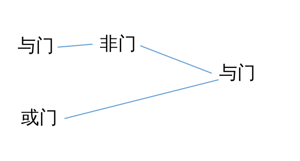

# linux简单介绍

## 计算机硬件介绍

### CPU

#### 干啥的

这个不用多介绍，cpu简单理解就是计算各种加减法的，复杂理解请看书。。。

#### 类型

市面上最常见的cpu架构有x86架构和arm架构，我们电脑上的cpu大多为x86架构，手机上的cpu大多位arm架构，平板则有的是搭载x86架构cpu,有的搭载arm架构cpu。最近很火的苹果的m1芯片就是arm架构，不过苹果把他用在了电脑上。  
其中x86是复杂指令集，arm是简单指令集。那么指令集是啥？这个问题之前，我们需要先讲一下cpu怎么工作的。  
我们都知道，cpu就是晶体管的组合，晶体管可以控制电压变化，晶体管组合就可以组成与或非门，与门就是只有我和你必须都满足条件最后结果才能符合条件，或门就是我和你之间只要有一个符合要求最后就符合要求，非门就是最后结果总是我的反方面。  
那么好了，与或非门继续组合，就可以组成加法、减法等基础操作了，比如1+0=和0+1=1以及0+0=0,这咋实现，很简单呀，我们刚才说的或们就可以实现，当然这有问题，还不能作为加法器，因为1+1=1，这就需要更复杂的组合了，比如下图（暂不考虑进位）  

这样一个简单的加法器就完成了，可想而知，更复杂的组合就可以实现加减乘除、处理正负数、整数小数的操作了  
接着，我们就需要将各种复杂的操作简化为一个指令，比如把a里面的数值放到b里面，需要找到a,读取a,找到b,写入b,我们就可以把这些复杂的操作用一个命令代替（比如mov b,a）,当然这个命令是啥样子由设计cpu的人说了算，而一堆这种命令就组成了指令集。  
但是很显然，cpu不断发展，功能不断增多，指令集越来越复杂，比如有前进、拿起、返回、拿茶杯四个命令，很显然当我们需要命令cpu拿茶杯回来时，只需要调用拿茶杯这个指令就可以了，但是人们发现我们可以拿前三个组成拿茶杯的指令，且还有些指令用的次数很少，所以指令集太复杂了，就把那些用的少的、可以由简单指令组合完成的指令精简精简，由此出现了精简指令集。  
指令集并没有谁更好谁更坏，复杂指令集更适合电脑这种生产力平台，简单指令集更适合手机这种需求简单的平台。至于续航啥的，x86好好优化续航也可以很好，arm摆烂耗电也可以起飞。  
指令集是啥说完了，接着说cpu的位数，你应该听说过64位cpu、32位系统啥的，这些位指的啥呢，cpu计算东西肯定要和外籍交换信息嘛，交换信息就要使用电线吧（电线已针脚的形式出现），64位、32位就是指的cpu输入数据的电线数，也就是一次性能告诉cpu多少位的数据，64位当然要比32位快，因为算一个大数，64位有可能一次就算完了，32位得传送两次，肯定就慢很多了嘛。那么对应的系统也就相应分为64位、32位啦，注意不是只有这两个，早先还有8位、16位等。  
注意哦，架构和位数不同哦，你可能会看到x86_64的名词，不要误以为架构和位数是相同的，你可以理解这个名词为64位的x86架构的cpu。

### 内存

#### 内存是怎么产生的

内存是干啥的，其实是cpu太快了，而我们的硬盘太慢，而我们的程序都在硬盘里面，这样会脱慢机器的速度，而大幅提高硬盘速度有点难，因此人们放弃了一些东西————存储功能来提升速度，因此产生了内存，内存相比硬盘，他的读取写入速度很快，勉强达到不妥cpu后退的程度，但是他不再能够存储内容，一断电内存中的数据就没了。

#### 内存的作用

上次我们已经将来，内存就是缓解硬盘和cpu速度差的存在，我们硬盘上存放了很多程序，当我们需要运行时，内存就会从硬盘中读取该软件，然后cpu再从内存中读取，哎，你会疑问，本来是直接从硬盘读取，现在中间加了个内存，时间不应该更长吗？实际上，我们的程序是不会一下在全部运行的，就向你与别人微信聊天时，朋友圈的部分就是不用运行的，所以我们把朋友圈放到内存里面，当你聊完天去看朋友圈时速度就会很快了，哎哎哎，你又发现，那刚打开程序时，内存里面是没有的呀，是的，第一次打开程序会很慢，还是要受限于硬盘速度的，因此你换个好一点的硬盘，你就会发现开机、启动软件的速度有了明显的提升。  
内存就这一个功能吗，不会的，聪明的人们总会充分利用有限的资源，我们不光要读取运行软件，我们还会编写word文档，这些输入的内容要拿硬盘存起来呀，但是我们知道了硬盘很慢，你想想，你编写完word文档了，点击保存，结果因为硬盘速度很慢，word软件保存了3分钟，这三分钟内你必须等着他保存完成才能关闭word,这体验多不舒服，于是聪明的人们想到先把这些保存到内存里面，然后系统就会告诉word软件已经保存完了，word就可以关闭了，实际数据还在内存里面，系统会默默的把这些数据写到硬盘里面。这会大大提升使用体验，但也有问题，就是我们和软件都认为已经写入到硬盘里面了，但实际上系统骗了我们，他还在内存里面，而内存一断电数据就丢失了，这就造成，如果你刚关闭word软件，数据还没完全写入到硬盘就遇到了断电。。。（我相信你能理解这种痛苦）还有你一定知道u盘有一个安全拔出的功能，你一定好奇这是干啥的，实际就是上面这个功能在做怪，你复制到u盘的东西可能还有一部分在内存里面，所以需要安全拔出来告诉系统赶紧从内存里面写入到u盘，所以你如果不点安全拔出直接拔掉u盘，就可能遇到文件没有复制进去的情况。

### 硬盘

硬盘就是存取数据的，大概分为机械硬盘和固态硬盘，机械硬盘里面是一张光盘，通过将光盘分为很多个分区，改变分区的磁性来记录信息，正极和负极对应0和1（也可能是1和0），很明显，当读取时需要拿磁头从这个地方移动到另一个地方来读取不同地方的数据。这依靠马达带动磁头，马达转的哪有电子快，所以就有了固态硬盘，固态硬盘里面靠读取电子来读取数据，没有了机械结构当然也就更快一点。当然还有是磁带的硬盘，里面不再使用光盘了，而是使用磁带来存储磁性信息，磁带嘛，只能从头转到尾，中间不能跳，我们从c盘跳到d盘需要磁带慢慢转一半的量，肯定不适合我们日用，但是他也是有用处的，那就是磁带很便宜，存储量很大，存一些长时间不会用的档案很适合。  
其中机械硬盘需要注意转速、SMR硬盘，转速不用多说，马达越快，当然读取越快，另一个需要注意的是硬盘是否为SMR硬盘，市面上看到的256MB缓存的基本上都是SMR硬盘，不要买，对，缓存大的不要买，为什么，因为SMR硬盘牺牲了读取速度来提高数据密度，这本来是个好事情，以前需要两个光盘才能达到1TB的容量，现在只需要1个光盘，自然成本低一些，但是资本家不这么认为，他们将省钱的SMR硬盘和正常硬盘一起卖，价格还一样，也不在介绍里面声明，提高一点缓存大小来诱导人们买缓存更大的硬盘，实际使用体验并不好。  

### 输入输出设备

这就不需要说了吧，键盘、鼠标、摄像头、麦克风都属于输入设备，显示屏、喇叭等等都属于输出设备。

## 常见各种系统

常见的系统，最常见的就是windows和安卓了，然后是ios、macos，再就是chromeos这几个系统占了整个市场的95%以上，剩下一点里面linux最多，再其次还有一些其他的系统，那就太小众了，此处不再详谈。（实际上我也不太了解。。。）  
windows，电脑最常见的系统，最近新版的win11外观已经很美观了，也可以使用wsa运行安卓应用，使用wsl运行linux应用，再加上windows较为开放，其上软件较多，因此至win11,windows的软件生态已经十分强大，完全满足一般人的使用。  
安卓，手机上最常见的系统，也是因为较为开放，所以软件生态较好，只是因为规范力较小（国内尤其严重），各个厂商并不按照谷歌的规范编写程序，导致软件质量参差不齐，界面统一性较差，这在手机上影响严重放大，也因此人们总觉得苹果手机比较流畅，实际上除系统机制的一些差距外，影响更明显的是软件生态。  
ios、macos,苹果家的，优秀产品的代表，因苹果较为严格的规范，这两个系统的可设置性并不高，但也因此换来了更稳定、软件生态更符合要求等好处，也正是因为这些好处，苹果的系统被很多人推崇。  
chromeos,这位国内人民可能了解较少，这货比较奇葩，具体呢就是，在国外，人们大多使用浏览器工作，比如国外最大的视频网站YouTube、音乐网站Spotify、游戏直播网站Switch等等都可以使用浏览器访问，有些如YouTube甚至没有桌面端软件，（这点国内很不好，看个啥都得下载app），所以谷歌一调查，发现人们每天打开电脑就是开浏览器，甚至写文档也在浏览器上（因为在线多人编辑一般是在浏览器上），既然大家用电脑的目的是使用浏览器，那还需要系统干啥，于是谷歌以chrome（谷歌旗下浏览器）为基础做出了chromeos,因为chromeos实际上就是一个浏览器，所以系统的占用很小，耗电也小，在性能较弱的cpu上也能流畅运行，所以chromeos在国外学生圈很流行，众所周知，学生党都很穷，那么花少点钱买个性能较弱的电脑，运行chromeos,既流畅续航友好，简直梦中情机。目前chromeos也支持运行linux、安卓应用了，生态也较为完善了，但是因为该系统极度依赖谷歌帐号，而国内访问不了谷歌，所以这个电脑拿到国内是连开机激活都激活不了的。  
linux,这是一类系统，linux是开源的，因此有很多不同的、各具特点的linux（上面说的安卓其实也可以算基于linux改过来的，但是linux好像不认安卓），其中较为有名的有：适合新手的Ubuntu、win无缝衔接的Mint、稳定的linux大佬debian、邪教Arch、折磨人的geetoo等等。我们以后还会具体讲，所以再次就不在详细介绍linux。

## 结尾

此文章是本人按照自己理解所写，旨在整理脑袋中的知识，精力有限，没时间思考大纲啥的，所以文章没有顺序，且不保证正确性，如有错误，欢迎提出，我将虚心学习。
